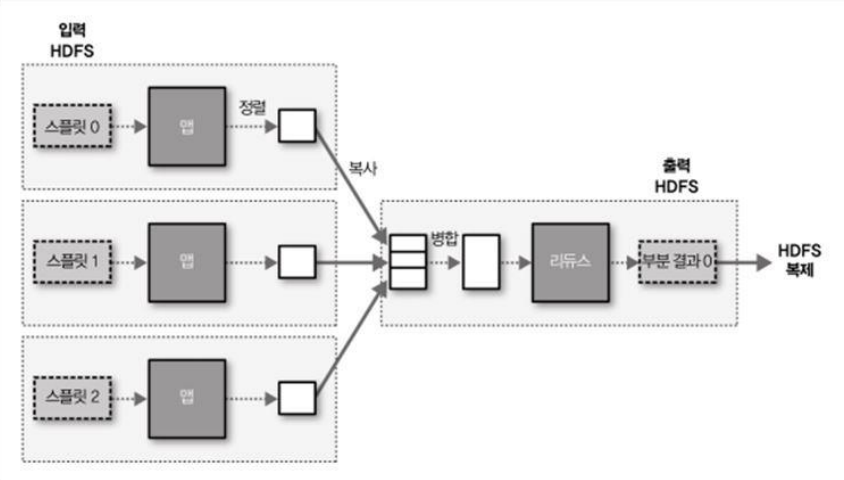
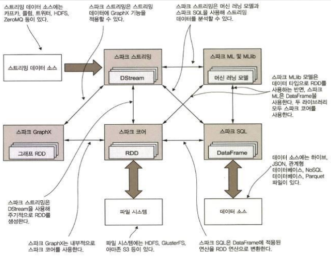

# Hadoop

## Hadoop Ecosystem
- linux
- Java(system)
- HDFS
- MapReduce
- Spark(Data Framework): MapReduce처럼 데이터를 디스크에서 매번 가져오지 않고 데이터를 **매모리**에 캐시로 저장(인-메모리 실행 모델)
  - 스칼라: 더 빠름
  - 파이썬

### HDFS

- **분산 파일 시스템**: 네트워크로 연결된 여러 머신의 스토리지 관리하는 파일 시스템

- 스트리밍 방식의 데이터 접근
- 높은 데이터 처리량 제공에 최적화: 응답시간 희생
  - 빠른 응답시간을 원한다면 HBASE가 대안
- 저장할 수 있는 파일 수는 네임노드의 메모리 용량에 좌우
- 단일 라이터: 파일에서 임의 위치에 있는 내용을 수정하는 것은 허용하지 않음
- **블록**: 한 번에 읽고 쓸 수 있는 데이터의 최대량
  - 파일 시스템 블록의 크기는 보통 수 킬로바이트, 디스크 블록의 크기는 512바이트
  - 사용자는 파일의 크기와 상관없이 파일을 읽고 쓸 수 있음
  - HDFS의 파일은 단일 디스크를 위한 파일 시스템처럼 특정 블록 크기의 chunk로 쪼개지고 각 chunk는 독립적으로 저장
  - 블록 크기보다 작은 데이터의 경우 전체 블록크기에 해당하는 하위 디스크를 모두 점유하지는 않음

- 네임노드와 데이터노드 + HDFS 클라이언트
  - HDFS 클러스터는 마스터-워커 패턴으로 동작(마스터: 하나의 네임노드, 워커: 여러개의 데이터 노드)
  - 네임노드
    - 파일시스템의 네임스페이스 관리
    - 파일시스템 트리와 그 트리에 포함된 모든 파일과 디렉터리에 대한 메타데이터 유지
    - 파일에 속한 모든 블록이 어느 데이터노드에 있는지 파악(위치 정보는 디스크에 영속적으로 저장X)
  - 데이터 노드
    - 파일 시스템의 실질적인 일꾼
    - 클라이언트나 네임노드의 요청이 있을 때 블록을 저장하고 탐색, 저장하고 있는 블록의 목록을 주기적으로 네임노드에 보고

### MapReduce

#### **Map 함수**
  - 단지 데이터의 준비 단계로, 리듀스 함수를 위해 데이터 제공
  - 잘못된 레코드 거르기
- 각 행맵 함수의 출력이 리듀스 함수의 입력으로 보내지는 과정은 맵리듀스 프레임워크에 의해 처리
#### **Reduce 함수**
  - 리스트 전체 반복하여 최고 측정값 추출

- 단일 리듀스 태스크의 맵리듀스 데이터 흐름


#### 맵 리듀스 원리
- Split
- `Map()`
- 셔플
- `Reduce()`
- output 저장 

<br>

### 빅데이터 수집 기술
- **Sqoop** by 아파치
  - RDBMS와 HDFS간의 데이터 연동
  - 양방향: Import & Export
  - 다양한 DB로부터의 자료 이동 지원

- **Flume** by Cloudera
  - 분산 환경에서 방대한 양의 이벤트 로그 수집 후 전송
  - 오픈 소스 로그 수집 소프트웨어
  - 다양한 로그 데이터 수집 및 모니터링이 가능하며 실시간 전송을 지원
  - 자바로 구현되어 있어 다양한 운영체제에 설치가 가능
  - 장애에 쉽게 대처 가능
  - 아키텍처
    - 에이전트: 소스, 채널, 싱크로 구성
    - 개별 에이전트의 연결이 가능
  - 구성요소
    - 소스: 지정한 소스를 통해서 이벤트를 받아 채널로 전달
    - 채널: 일종의 큐로서 이벤트를 임시로 보관
    - 싱크: 채널에서 이벤트를 읽어와 출력 대상에 씀

- **Kafka** by Linkedin
  - 분산 시스템에서 메시지 전송 및 수집
  - 웹 사이트, 어플리케이션, 센서 등에 취합한 데이터를 스트림 파이프라인을 통해 실시간으로 관리하고 보내기 위한 분산 스트리밍 플랫폼
  - 데이터를 생성하는 어플리케이션과 데이터를 소비하는 어플리케이션 간의 중재자 역할 -> 데이터의 전송 제어, 처리, 관리 역할
  - 어플리케이션과 서버 간의 비동기 데이터 교환을 용이하게 함
  - 확장성(scale-out), 고가용성(High Availability)
  - 구성
    - **Cluster**: 여러 대의 컴퓨터들이 연결되어 하나의 시스템처럼 동작하는 컴퓨터들의 집합
    - **Producer**: 특정 Topic의 메시지를 생성한 뒤 해당 메시지를 Broker에 전달(전달자)
    - **Consumer**: 분류하여 쌓아놓은 Topic별로 해당 Topic 구독하는 consumer들이 메시지를 가져가서 처리(소비자)
    - **Broker**: Topic을 기준으로 메시지 관리(중재자)
    - **Topic**: 보내는 메시지를 구분하기 위한 카테고리화
    - **Partition**: 토픽을 구성하는 데이터 저장소로서 수평확장이 가능한 형태
  
<br>

### 빅데이터 저장 기술
- **분산 파일 시스템**
  - **HDFS**: 대표적인 오픈소스 분산파일시스템
    - 대용량 파일의 스트리밍 읽기와 쓰기에 뛰어난 성능
    - 단일 중앙 서버에 저장된 파일시스템 메타데이터는 블록 데이터의 디렉터리 역할
  - **Hive**: HDFS기반의 DataWarehouse
    - SQL 쿼리를 MapReduce 작업을 위해 컴파일하고 클러스터에서 실행되게 함
    - RDBMS와 차이점
      - 작은 데이터일 경우 응답 속도가 느림
      - 레코드 단위 insert, update, delete 지원하지 않음
      - 트랜잭션을 지원하지 않음
      - 통계정보 바로 확인 불가
      - 입력값 오류 바로 확인 불가
    - 데이터 모델
      - 테이블
      - 파티션
        - 테이블은 하나 이상의 파티션 키를 가짐
        - 데이터 접근을 위한 테이블 구조이 최적화(인덱스)
      - 버킷
        - 파티션의 데이터는 특정 해쉬 함수에 의해서 버킷으로 분할
        - 특정 범위의 해쉬 파티션(샘플링)
    - 메타스토어
    - 물리적 레이아웃
  - S3: 아마존의 클라우드 기반 분산 스토리지 서비스

- **NOSQL**
  - **HBase**: HDFS기반의 NOSQL
    - 데이터 모델
      - 테이블: 로우들의 집합, 로우키, 1개 이상의 컬럼패밀리
      - 로우키: 임의의 바이트열, 사전순으로 내림차순 정렬
      - 컬럼패밀리: 컬럼들의 그룹, 컬럼패밀리의 멤버컬럼은 같은 접두사
      - 셀: 로우키&컬럼&버전이 명시된 튜플, 값은 임의의 바이트열이며 Timestamp가 있음
  - Cassandra: ACID 속성을 유지한 분산 데이터베이스
  - 몽고DB: DB의 수평 확장 및 범위 질의 지원, 자체 맵리듀스

<br>

### **Spark**


#### **스파크 코어**: 스파크 잡과 다른 스파크 컴포넌트에 필요한 기본 기능 제공
  - **RDD**
    - 스파크 API의 핵심요소
    - 분산 데이터 컬렉션(데이터셋)을 추상화한 객체
    - 데이터셋에 적용할 수 있는 연산 및 변환 메서드 함께 제공
    - RDD 연산자: **변환(transformation)** & **행동(action)**
      - **변환 연산자**는 항상 새로운 RDD 객체 생성(`filter`나 `map` 함수)
        - `map`: RDD의 모든 요소에 임의의 함수를 적용할 수 있는 변환 연산자
          - `filter` 함수와 달리 map 함수가 호출된 RDD의 타입은 map 함수가 반환하는 RDD의 타입과 같을 수도 있고 다를 수도 있음
        - `flatMap`: 배열의 배열을 단일 배열로 분해, 기본적으로 주어진 함수를 RDD의 모든 요소에 적용한다는 점은 map과 동일
        - `distinct`: RDD의 고유 요소로 새로운 RDD 생성
        - `sample`: 호출된 RDD에서 무작위로 요소를 뽑아 새로운 RDD를 만드는 변환 연산자
          ```python
          def sample(vdthReplacement: Boolean, fraction: Double, seed: Long = Utils.random-nextLong):RDD[T]
          ```
          - `vdthReplacement`: 같은 요소가 여러 번 샘플링 될 수 있는지
          - `fraction`: 복원 샘플링에서는 각 요소가 샘플링될 횟수의 기댓값(0이상 값) / 비복원 샘플링에서는 각 요소가 샘플링될 기대 확률
          - `seed`: 난수 생성에 사용하는 시드. 프로그램 테스트하는 데 유용

      - **행동 연산자**는 연산자를 호출한 프로그램으로 계산 결과를 반환하거나 RDD 요소에 특정 작업을 수행하려고 실제 계산을 시작하는 역할(`count`나 `foreach` 함수)
        - `takeSample`: 확률 값 대신 정확한 개수로 RDD 요소 샘플링
          - `sample` 메서드와 차이점: 두 번째 인자는 샘플링 결과로 반환될 요소의 개수를 지정하는 정수형 변수
        - `take`: 지정된 개수의 요소를 모을 때까지 RDD의 파티션을 하나씩 처리해 결과 반환
          - 파티션: 클러스터의 여러 노드에 저장된 데이터의 일부분
          - 결과는 단일 머신에 전송되므로 인자에 너무 큰 수를 지정해서는 안 됨

    - **Double RDD** 함수: 기초 통계량 계산
      - `mean`, `sum`, `variance`, `stdev`
      - `histogram`: 데이터 분포 시각화
        - 첫 번째 버전: 구간 경계를 표현하는 Double 값의 배열 받고, 각 구간에 속한 요소 개수를 담은 Array 객체 반환(Double 배열은 오름차순, 구간은 한 개 이상, 중복 안 됨)
        - 두 번째 버전: 구간 개수를 받아 이것으로 입력 데이터의 전체 범위를 균등하게 나눈 후 요소 두 개로 구성된 튜플 하나를 결과로 반환(구간 개수로 계산된 구간 경계의 배열, 각 구간에 속한 요소 개수가 저장된 배열)
        ```
        >>> intIds.histogram([1.0, 50.0, 100.0])
        ([1.0, 50.0, 100.0], [9, 5])
        >>> intIds.histogram(3)
        ([15.0, 42.66666666666667, 70.33333333333334, 98], [9, 0, 5])
        ```

    - **Pair RDD**
      - 키-값 쌍은 간단하고 범용적이고 확장성이 뛰어난 데이터 모델
      - 새로운 타입의 키와 값을 손쉽게 추가 가능, 키-값 쌍을 독립적으로 저장 가능
      - 여러 프레임워크와 애플리케이션의 기본 요소
      - 키와 값에 정수형이나 문자열 등 기본 타입과 복잡한 데이터 구조도 사용 가능
      - 전통적으로 *연관 배열(associative array)*이라는 자료 구조 사용(파이썬에서는 딕셔너리, 스칼라와 자바에서는 맵)
      - Spark Context의 일부 메서드는 Pair RDD를 기본으로 반환
  

    - *복원성*: 노드에 장애가 발생해도 데이터 셋을 재구성
    - *불변성*: 생성된 RDD는 절대 바뀌지 않는 불변의 성질
    - *분산*
    - 리스트, 맵, 셋 등 기존의 평범한 로컬 컬렉션을 사용하는 방법과 같음
    - 목적: 분산 컬렉션의 성질과 장애 내성을 추상화하고 직관적인 방식으로 **대규모 데이터 셋에 병렬 연산**을 수행할 수 있도록 지원
    
  - HDFS, GlusterFS, 아마존 S3 등 다양한 파일 시스템에 접근 가능
  - 공유 변수와 누적 변수를 사용해 컴퓨팅 노드 간에 정보 공유
  - 네트워킹, 보안, 스케줄링 및 데이터 셔플링

#### **스파크 SQL**
  - 스파크와 하이브 SQL(HiveQL)이 지원하는 SQL을 사용해 대규모 분산 정형 데이터를 다룰 수 있음
  - 파일, Parquet 파일, 관계형 데이터 베이스 테이블, 하이브 테이블 등 다양한 정형 데이터 읽고 쓰는 데 사용
  - DataFrame, Dataset에 적용된 연산을 일정 시점에 RDD 연산으로 변환해 일반 스파크 잡으로 실행
  - 카탈리스트(Catalyst)라는 쿼리 최적화 프레임워크 제공, 사용자가 직접 정의한 최적화 규칙 적용
  - BI(Business Intelligence) 도구 등 외부 시스템과 스파크를 연동 가능한 아파치 쓰리프트(Thrift) 서버도 제공

#### **스파크 스트리밍**
  - 다양한 데이터 소스에서 유입되는 실시간 스트리밍 데이터를 처리하는 프레임워크
  - HDFS, Kafka, Flume, Twitter, ZeroMQ
  - 장애 발생 시 연산 결과 자동으로 복구
  - 이산 스트림 방식: 스트리밍 데이터를 표현하는데 가장 마지막 타임 윈도 안에 유입된 데이터를 RDD로 구성해 주기적으로 생성
  - 스파크 스트리밍과 다른 스파크 컴포넌트를 단일 프로그램에서 사용해 실시간 처리 연산과 머신 러닝 작업, SQL 연산, 그래프 연산 등 통합
  - 정형 스트리밍 API를 새롭게 도입해 일괄 처리 프로그램을 구현하는 것처럼 스트리밍 프로그램 구현

#### **스파크 MLlib**
  - 머신 러닝 알고리즘 라이브러리
  - RDD 또는 DataFrame의 데이터셋을 변환하는 머신 러닝 모델을 구현

#### **스파크 GraphX**
  - **그래프**: 정점과 두 정점을 잇는 간선으로 구성된 데이터 구조
  - 그래프 RDD 형태의 그래프 구조를 만들 수 있는 다양한 기능 제공
  - 페이지랭크, 연결요소, 최단경로 탐색, SVD++ 등 그래프 이론에서 중요한 알고리즘


