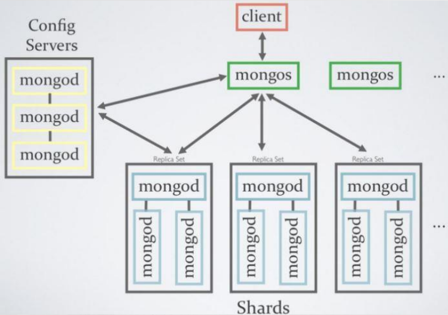

 ## NoSQL(JSON)

- **MongoDB**
- **HBASE(하둡)**
- `{key: value}`
- 최근 클라우드 컴퓨팅 환경에서 발생하는 빅데이터 저장, 관리 문제점 보완(새로운 데이터 저장 기술)
- 장점
  - 클라우드 컴퓨팅 환경에 적합
    - 오픈 소스
    - 하드웨어 확장에 유연한 대처
    - RDBMS에 비해 저렴한 비용으로 분산처리, 병렬처리 가능
  - 유연한 데이터 모델
    - 비정형 데이터 구조 설계로 설계 비용 감소
    - 관계형 DB의 Relationship과 Join구조를 Linking과 Embedded로 구현하여 성능 빠름
  - 빅 데이터 처리에 효과적
    - memory mapping기능 -> read/write 빠름
    - 전형적인 OS와 하드웨어에 구축가능
    - 기존 RDB와 동일하게 데이터 처리 가능

- 서버 여러개를 한 컴퓨터가 다룸(RDBMS는 큰 서버 안에 여러개의 서버가 있고 여러개의 컴퓨터가 다룸)

 

### MongoDB 특징
- **JSON Type**의 데이터 저장 구조(key-value)
  - JSON, BSON 포맷
  - 배열 형태 / 계층적 구조의 데이터를 쉽게 다룰 수 있음
- **Document** 기반의 데이터베이스(기존 RDBMS는 Row 단위의 레코드 기반)
  - _id라는 ObjectID 타입의 값을 가짐
  - RDBMS의 PK와 동일한 개념으로 유일함 보장
- **Sharding**(분산)
  - 여러 장비에 걸쳐 데이터를 분할하는 과정(Partioning)
  - Mongos라는 라우터는 ObjectID로 데이터가 존재하는 Shard에만 데이터 요청

  - Primary와 Secondary로 구분되는 **Replica Set**
- Join 불가능   
- 메모리 의존적
  - 메모리 맵 형태의 파일엔진 DB
  - 메모리 크기가 전체 성능 결정

 

---

 

1. **_ID Field** : Primary Key
2. **Collection** : Table
  - 구성 요소(필드명, 데이터 타입 등)가 결정되어 있지 않더라도 데이터 저장 구조 생성
3. **BSON Field** : Column
4. **BSON Document** : Row
5. **Embedded & Linking** : RelationShip
